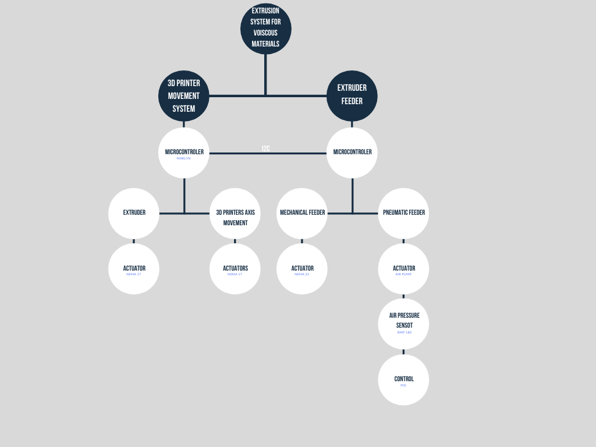
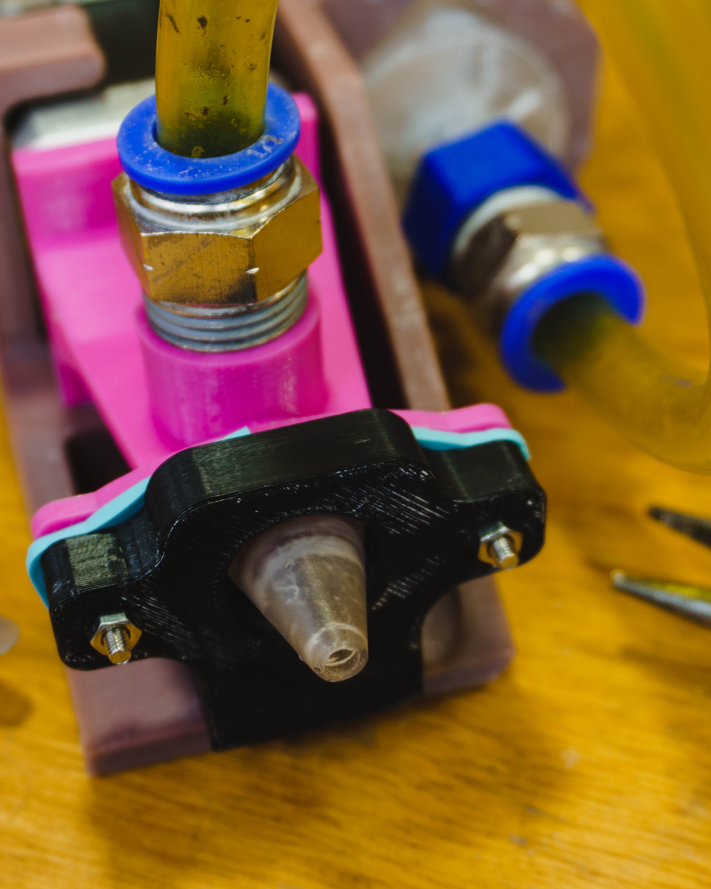

# Marlin4Clay

Marlin4Clay is an I2C enabled [Marlin](https://github.com/MarlinFirmware/Marlin) version for, and a specific firmware for extrusion systems for viscous materials 3D printers.

The system enables the interaction between the feeder, and the extruder. 

## Arquitecture

### The Extruder

The extruder is an [auger screw](http://unfoldfab.blogspot.com/2012/08/road-to-better-paste-extrusion-episode.html) based system wich control comes directly from the Marlin firmware, wich follows the Gcodes instructions from the slicer. 

### The Feeder

[//]: <> (picture)

The feeder stores the material away from the extruder, to reduse the systems inertia. It can be operated through a Stepper motor and a lead screw, or an air pump. 

## BioFeeder

[//]: <> (picture)

BioFeeder is a DIY Arduino Uno Shield developed to provide the following functions: 

- I2C Comunication
- Stepper Motor control
- Air pump control
- Air pressure sensor through I2C comunication

[//]: <> (### Bill of Materials)